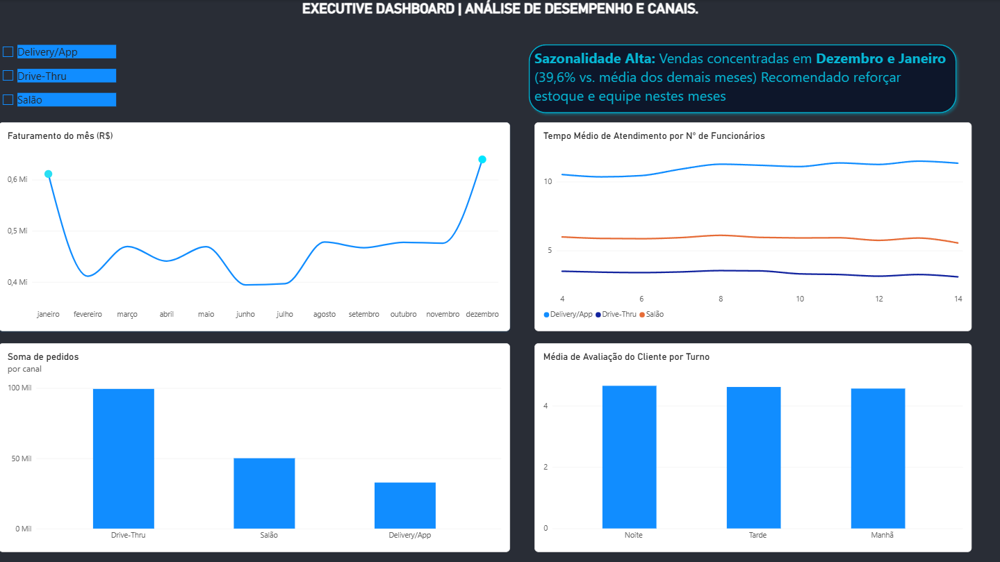

# 📊 Análise de Operação de Loja Fast Food

Projeto de portfólio em análise de dados, simulando a operação de uma unidade de fast food 
ao longo de 2025 (vendas, turnos, canais de atendimento e satisfação do cliente).

O dataset é fictício, mas as métricas e a lógica de negócio foram construídas com base na 
minha experiência real como gestor de área em uma rede de fast food.

## 🎯 Objetivo
Praticar o ciclo completo de análise de dados: modelagem em SQL, extração de insights via 
queries e construção de um dashboard executivo, respondendo perguntas de negócio reais de 
uma operação de loja.

## 🛠️ Ferramentas utilizadas
- **PostgreSQL** — modelagem e queries analíticas
- **Power BI** — dashboard interativo
- **SQL** — agregações, CTEs e cálculos de percentual

## 🗂️ Estrutura dos dados
- `vendas_lanchonete_2025.csv` — vendas por dia, turno e canal (3.285 linhas)
- `funcionarios.csv` — quadro de funcionários fictício, usado para prática de JOIN
- `dicionario_dados.md` — descrição de cada coluna
- `dashboard_operacao_lanchonete.pbix` — arquivo do dashboard em Power BI

## 🔍 Principais insights
- **Sazonalidade:** Dezembro e Janeiro têm faturamento 39,6% acima da média dos demais meses.
- **Equipe x tempo de atendimento:** turnos com menos funcionários apresentam tempo médio de 
  atendimento maior — mas esse padrão só fica claro ao **segmentar por canal**. Analisando os 
  canais juntos, a relação ficava "escondida", pois cada canal tem um tempo-base muito diferente 
  (Drive-Thru é naturalmente mais rápido que Delivery). Esse foi um bom aprendizado sobre 
  **variáveis de confusão** na análise de dados.
- **Satisfação do cliente:** turnos com atendimento mais lento apresentam nota média mais baixa.

## 📈 Dashboard

## 👤 Autor
Gabriel — em transição de carreira para análise de dados.
[LinkedIn](https://www.linkedin.com/in/gabriel-david-5b6522270/)
